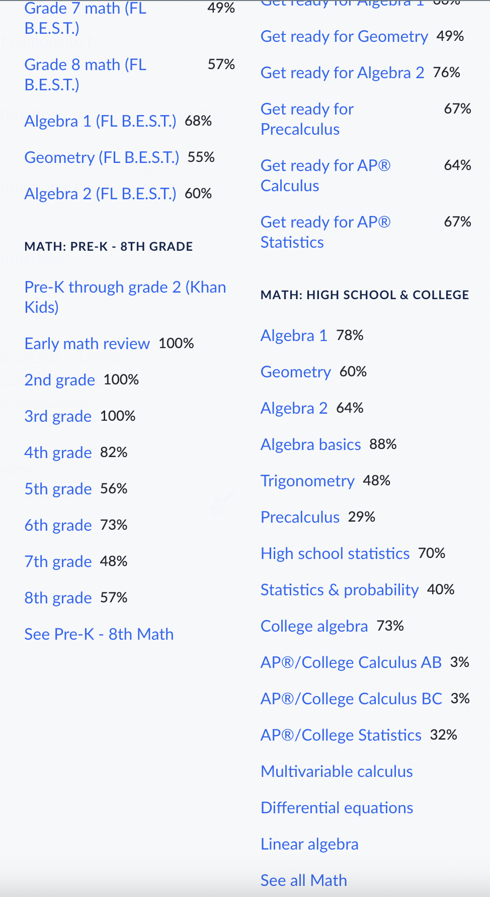

# Midlife Rethink

If I am not pushing code I am either studying more math or doing some research. I thought it would be nice to keep daily activities tracked on my own.

---

### Why?

Everyone is different, I woke up one day and just asked myself what am I doing with my life? I might elobrate on this further on a different forum it has a lot of back story on how I got here and what I am doing now.

---

### Daily Routines

Instead of going to the gym 2-3 times a week I go every day now with at least 30 minutes of cardio. Moving from the west to the east coast I noticed a change in sleep patterns.

Since I am currently not working

- wake up ~7-8am
- 1 cup of ice coffee
- check personal email
- Anything interesting on [hackernews](https://hackernews.com)
- gym 45min - 1hour
- learn/study either at home or at a coffee place 4-5hours
- take a walk outside 30-45min
- continue with learning and studying for another 7-8hours
- sleep by 12-1am

I have interviews on some days and usually I plan 2 hours for questions and research before the interview. I have a long journey with this and deserves a whole article/book.

---

### Study

Being a frontend engineer I always have to keep up with technology for the web. Another new CSS selector, webGPU, vite, its a lot and on top of this I have to be proficient in algroithms and data structures, a little backend, system design, CI/CD etc.

It's not a bad thing just overwhelming, and I've always said the more knowledge you have the better.

I even picked up Machine Learning 5 years ago and received certificates from coursera. There is reasons I got into this (see the math section).

Recently I finished the [#100DaysOfSwiftUI](https://www.hackingwithswift.com/100/) Since I have React Native experience a lot of jobs that needed someone proficient in React Native also needed to have some Native experience. Not only that but I have heard good things about SwiftUI. SwiftUI is still evolving but I think its worth knowing.

Some days are spent solving leetcode problems or learning math on khan academy.

---

### Goal

The mission/goal my whole life has been wanting to create educational games or environments where a person is immersed in learning what they want to learn.

Education through games or environments I believe is a great way to learn new concepts and even remember concepts vividly.

I started doing this when I was in college teaching a class of people HTML in a 3D environment or even attending classes virtually was really neat. [SecondLife](https://secondlife.com/)

Now with Apple Vision Pro coming out I think its my calling to create something really cool. The goal is to start small and always be shipping. I have some ideas.

---

### Math

Will fill this section out later but the goal is to get 100% in all Math categories:

(its not a speedrun and some months are better than others)

