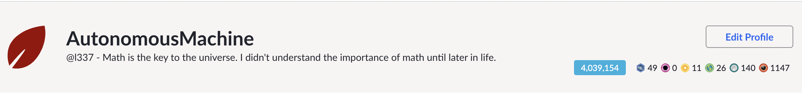

# Midlife Rethink

If I am not pushing code I am either studying more math or doing some research. I thought it would be nice to keep daily activities tracked on my own.

---

### Why

Everyone is different, I woke up one day and just asked myself what am I doing with my life? I might elobrate on this further on a different forum it has a lot of back story on how I got here and what I am doing now.

---

### What am I doing now

Almost 6 months Ive been jobless I...

- Took 7 courses on Frontend Masters.
- Solved leetcode problems (some problems took 3 hours to solve if longer than that I have to look at the solution and learn from it).
- A complete re-write and re-design of my resume (twice).
- Bought a domain name and used Astro to layout the pages and hooked it up to github for CI/CD so I can post web/mobile experiments, blog, or contact me for work.
- A lot of time preparing for interviews, reading, watching practice interviews on youtube, putting some time into not being so nervous/stressed.
- Studying something entirely different (SwiftUI, Django, Flask).
- More practice with mathematics on Khan Academy
- Eating only healthy foods and cooking every night.
- Bringing my kindle outside to read @ sunset. (sometimes)

I don't watch TV and I recently had cancelled my Netflix. There's a strike going on, and Ai for shows/movies? Ew.

---

### Daily Routines

Instead of going to the gym 2-3 times a week I go every day now with at least 30 minutes of cardio. Moving from the west to the east coast I noticed a change in sleep patterns.

Since I am currently not working

- wake up ~7-8am
- 1 cup of ice coffee
- check personal email
- Anything interesting on [hackernews](https://hackernews.com)
- gym 45min - 1hour
- learn/study either at home or at a coffee place 4-5hours
- eat lunch 30min (a salad or a banana)
- take a walk outside 30-45min
- continue with learning and studying for another 4-5hours
- meditate 30min
- more studying then sleep by 12-1am

I have interviews on some days and usually I plan 2 hours for questions and research before the interview. I have a long journey with this and deserves a whole article/book.

---

### Gym

I am not going to the gym every day for the gains, I am going for the mind (cognitive health) and because I seem to stress a lot.

Biking every other day (~400 calories) starting at level 9 and increasing by 1 every 10 minutes.

The days I am not biking (every other day) I am running between ~3.5 to ~3.7 miles over a 5k:

- First minute speed 3.2 incline 1.5
- speed 7.6 incline 1.5 min 5
- speed 7.8 incline 1.5 min 10
- speed 8.0 incline 1.5 min 15
- speed 8.2 incline 1.5 min 20
- speed 3.2 incline 1.5 min 22 (walk for 2min before 3-4 min of uphill)
- speed 4.6 incline 15.0 min 25-26 (major uphill).
- speed 3.2 incline 1.5 min 26-27
- speed 8.0 incline 1.5 min 28:30
- speed 8.4-8.8 incline 1.5 min 29
- speed 9.2-9.6 incline 1.5 min 29:30
- speed 3.2 incline 1.5 min 30 (finish by a min walk)

Before running or cycling I focus on one muscle area for 15-20min whether its my core, chest, arms or legs.

This has become a habit now since I have been doing it every day for the past 4 months.

---

### Study

Being a frontend engineer I always have to keep up with technology for the web. Another new CSS selector, webGPU, vite, its a lot and on top of this I have to be proficient in algroithms and data structures, a little backend, system design, CI/CD etc.

It's not a bad thing just overwhelming, and I've always said the more knowledge you have the better.

I even picked up Machine Learning 5 years ago and received certificates from coursera. There is reasons I got into this (see the math section).

Recently I finished the [#100DaysOfSwiftUI](https://www.hackingwithswift.com/100/) Since I have React Native experience a lot of jobs that needed someone proficient in React Native also needed to have some Native experience. Not only that but I have heard good things about SwiftUI. SwiftUI is still evolving but I think its worth knowing.

Some days are spent solving leetcode problems or learning math on khan academy.

---

### Goal

The mission/goal my whole life has been wanting to create educational games or environments where a person is immersed in learning what they want to learn.

Education through games or environments I believe is a great way to learn new concepts and even remember concepts vividly.

I started doing this when I was in college teaching a class of people HTML in a 3D environment or even attending classes virtually was really neat. [SecondLife](https://secondlife.com/)

Now with Apple Vision Pro coming out I think its my calling to create something really cool. The goal is to start small and always be shipping. I have some ideas.

---

### Math

Will fill this section out later but the goal is to get 100% in all Math categories:

(its not a speedrun and some months are better than others)

Currently taking the Calculus courses. The courses that are not complete ill come back to. Most of the quizes I am saving, I think if I do them later so I can remember what I learned (longevity hippocampus memory). Watching all videos with the units along with completing the exercises, and some exercises I have to use pen and paper.
